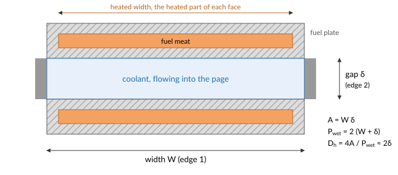
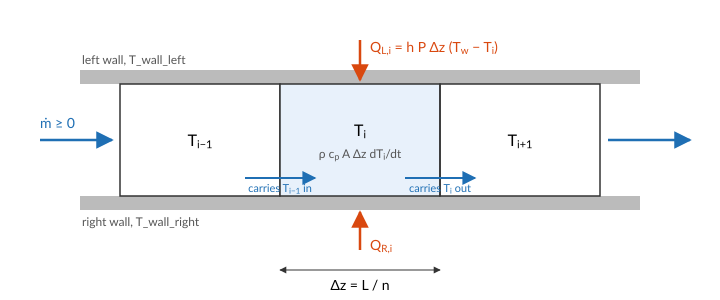

# The coolant channel

A coolant channel is a duct with heated walls: the gap between two fuel plates, the
subchannel between fuel rods, or a plain pipe. STREAM has three channel components, and they
share one set of equations. They differ only in how heat reaches the coolant:

| Component | Heat input per cell | Use it when |
|:---|:---|:---|
| [`Channel`](@ref STREAM.Components.Channel) | ``h\,P\,\Delta z\,(T_w - T)``, with ``h`` given and ``T_w`` bound in the connection list | the wall temperature is known, or the channel is unheated |
| [`ChannelHeatFlux`](@ref STREAM.Components.ChannelHeatFlux) | ``q''\,P\,\Delta z``, with ``q''`` bound in the connection list | the heat flux is known |
| [`ChannelAndContacts`](@ref STREAM.Components.ChannelAndContacts) | ``h\,P\,\Delta z\,(T_w - T)``, with ``h`` from a heat transfer model and ``T_w`` from a thermal port | the channel cools a fuel plate |

Here ``P`` is the heated perimeter of one face and ``\Delta z = L/n``. Each has a left and a
right face, so a channel between two plates is heated from both sides. For a plate-fuel
channel, [`PipeGeometry_rectangular`](@ref) takes the two edges of the cross-section and the
heated width of each face:



## Discretisation

The channel is cut into ``n`` cells of equal length along the flow. Each cell holds one bulk
temperature ``T_i``, the mixed-mean temperature of the coolant in it. All cells carry the same
mass flow ``\dot m``: the coolant is a liquid, so the channel stores no mass, and what enters
one end leaves the other at the same instant.



## Energy

Each cell is a control volume of length ``\Delta z`` and area ``A``. The first law of
thermodynamics for it says the energy it holds changes by what the flow brings in, less what
the flow carries out, plus the heat from its walls:

```math
\frac{d}{dt}\big(\rho_i\,u_i\,A\,\Delta z\big) = |\dot m|\,h_\text{in} - |\dot m|\,h_\text{out}
+ Q_{L,i} + Q_{R,i},
```

with ``u`` the internal energy and ``h = u + p/\rho`` the enthalpy, the energy a unit of mass
carries across a boundary including the work the flow does to push it there. The kinetic
energy of the coolant and the work of friction are negligible next to these, and the coolant
leaving a cell is at the cell's temperature. For a liquid, ``du = dh = c_p\,dT``, and the
small change of density with temperature can be left out of the storage term. The cell's
temperature then obeys

```math
\rho_i\,c_{p,i}\,A\,\Delta z\,\frac{dT_i}{dt}
= |\dot m|\,\big(h(T_{\text{up},i}) - h(T_i)\big) + Q_{L,i} + Q_{R,i},
```

and STREAM evaluates the enthalpy difference with the specific heat averaged over the face
the coolant crosses:

```math
h(T_\text{up}) - h(T_i) = \int_{T_i}^{T_\text{up}} c_p\,dT
\approx \bar c_p\,(T_{\text{up},i} - T_i),
\qquad \bar c_p = \tfrac12\big(c_p(T_{\text{up},i}) + c_p(T_i)\big).
```

``T_{\text{up},i}`` is the temperature of the cell upstream: ``T_{i-1}`` when ``\dot m \ge 0``
and ``T_{i+1}`` when ``\dot m < 0``, with the temperature arriving through the inlet or the
outlet port at the two ends. This is first-order upwinding: the coolant entering a cell
carries the temperature of the cell it came from. The specific heat is averaged over the face
the coolant crosses, which keeps the energy balance exact for a temperature-dependent
``c_p``.

At steady state the left side vanishes, and the cells together satisfy the channel's energy
balance exactly, whatever ``n``:

```math
\sum_i (Q_{L,i} + Q_{R,i}) = |\dot m| \int_{T_\text{in}}^{T_\text{out}} c_p\,dT.
```

In a transient, upwinding smears a temperature front over a few cells, an effect called
numerical diffusion: it acts like an axial diffusivity of about ``v\,\Delta z/2``, with ``v``
the coolant velocity. A front that must stay sharp, such as the hot coolant leaving a plate after a power excursion, needs cells
smaller than the distance it travels over the time scale that matters. There is no axial heat
conduction in the coolant, which at the Péclet numbers of forced flow is negligible.

## Momentum

The flow is one variable for the whole channel. Applying the loop equation of
[Pressure drop](@ref) over the channel's length, cell by cell, gives its momentum balance:

```math
\frac{L}{A}\,\frac{d\dot m}{dt} = p_\text{in} - p_\text{out} - \sum_i \Delta p_i,
\qquad
\Delta p_i = f_i\,\frac{\Delta z}{D_h}\,\frac{\dot m\,|\dot m|}{2\,\rho_i\,A^2}
           + \rho_i\,g\,\Delta z.
```

The first term of ``\Delta p_i`` is friction, with ``f_i`` from the channel's friction model
(see [Pressure drop](@ref)) evaluated at the cell's temperature. Writing it with
``\dot m|\dot m|`` keeps its sign opposed to the flow when the flow reverses. The second term
is the weight of the coolant in the cell, with ``g`` the signed component of gravity along the
flow: negative when the inlet is at the top, positive when it is at the bottom. Because
``\rho_i`` is evaluated at each cell's temperature, a hot channel is lighter than a cold one,
and that difference is what drives natural circulation.

The left side is the inertia of the coolant in the channel. It is small for one channel, but
it makes the flow a differential variable, so a channel's flow responds to a pressure change
over a time ``L/A`` times the flow resistance, rather than instantly.

## Pressure and saturation

The pressure a [`FlowPort`](@ref STREAM.Components.FlowPort) carries is the *total* pressure,
static plus dynamic ``\rho v^2/2``. Saturation depends on the static pressure, which each cell
works out from the inlet:

```math
p_{s,i} = p_\text{in} - \sum_{j \le i} \Delta p_j - \frac{\dot m^2}{2\,\rho_i\,A^2}.
```

Each cell then reports its saturation temperature `T_sat` at ``p_{s,i}``, and its
[Onset of nucleate boiling](@ref) temperature `T_ONB`. In downward flow the hydrostatic term
raises the pressure along the channel, so `T_sat` rises towards the outlet. In upward flow it
falls.

## A solved channel

A rectangular channel 2.4 mm by 67 mm and 0.6 m long, with water entering at the top at
40 °C and 1.7 bar, and both walls held at a temperature that peaks mid-height:

```@example channel
using STREAM, CairoMakie
using STREAM.Components: Pump, HeatExchanger, Channel
using STREAM.Assemblies: inseries
using STREAM.Utilities: cosine_T_wall_profile
using ModelingToolkit: @named, mtkcompile
CairoMakie.activate!(type="svg")

n = 20
geometry = PipeGeometry_rectangular(0.6, 0.067, 0.0024, 0.067)
T_wall = 60.0 .+ 60.0 .* cosine_T_wall_profile(n)      # 60 °C at the ends, 120 °C mid-height

@named pump = Pump(2.0e4)
@named hx = HeatExchanger(40.0)
@named ch = Channel(; n, geometry, g=-G_EARTH, h_left=2.0e4, h_right=2.0e4)
connections = [
    inseries(pump, hx, ch, pump),
    pump.inlet.p ~ 1.7e5,
    ch.T_wall_left .~ T_wall,
    ch.T_wall_right .~ T_wall,
]
@named loop = assembly(connections, pump, hx, ch)
sys = mtkcompile(loop)
sol = solve_steady(sys, [sys.ch.inlet.ṁ => 0.5])

z = ((1:n) .- 0.5) .* geometry.L ./ n
fig = Figure(size=(700, 420))
ax = Axis(fig[1, 1]; xlabel="distance from the inlet [m]", ylabel="temperature [°C]")
lines!(ax, z, T_wall; label="wall")
lines!(ax, z, sol[sys.ch.T]; label="bulk coolant")
lines!(ax, z, sol[sys.ch.T_sat]; label="saturation", linestyle=:dash)
lines!(ax, z, sol[sys.ch.T_ONB]; label="onset of nucleate boiling", linestyle=:dot)
axislegend(ax; position=:rb)
fig
```

The bulk rises fastest where the wall is hottest, and the saturation temperature rises
slowly along the channel with the hydrostatic pressure. Mid-height the wall is above
saturation, yet the coolant does not boil there: nucleation needs the wall superheat of the
[Onset of nucleate boiling](@ref), and the wall stays below it everywhere. Its closest
approach, in kelvin, is

```@example channel
minimum(sol[sys.ch.T_ONB] .- T_wall)
```

The flow is

```@example channel
sol[sys.ch.inlet.ṁ]
```

kg/s.

## What the model leaves out

- **Two-phase flow.** The coolant is liquid everywhere. Subcooled boiling at the wall can be
  modelled as a heat transfer regime (see [Wall heat transfer](@ref)), but the void it makes
  is not: past [Onset of significant void](@ref) the channel is outside the model.
- **Compressibility and mass storage.** The flow is the same in every cell. Thermal expansion
  of the coolant changes its density, and so its weight and friction, but not the flow along
  the channel.
- **Lateral variation.** One temperature per cell is the mixed-mean temperature. The hottest
  coolant, next to the wall, is reached through the heat transfer coefficient, not resolved.
