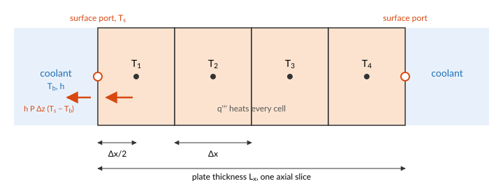

# Heat conduction in a fuel plate

The heat a fuel plate generates has to conduct to its surfaces before the coolant can take it.
[`HeatDiffusion`](@ref STREAM.Components.HeatDiffusion) models this for a plate: a slab of
thickness ``L_x``, height ``L_z`` along the flow and depth ``y`` into the page, cut into
``n_z \times n_x`` cells.

## The heat equation

Heat in a solid flows down the temperature gradient, at a rate set by the conductivity
``k``: Fourier's law, ``\mathbf{q}'' = -k\,\nabla T``. Energy conservation in a small volume
says its stored heat changes by what conducts in, less what conducts out, plus what it
generates at the volumetric rate ``q'''``:

```math
\rho\,c_p\,\frac{\partial T}{\partial t} = -\nabla\cdot\mathbf{q}'' + q'''
= \nabla\cdot(k\,\nabla T) + q'''.
```

A fuel plate is thin: about a millimetre thick and hundreds of millimetres long. A temperature
difference across its thickness drives heat through a path a few hundred times shorter, and a
few hundred times wider, than the same difference along its length, so conduction across the
plate outweighs conduction along it by the square of that ratio. STREAM keeps only the
conduction across the thickness ``x``, and each axial slice of the plate solves

```math
\rho\,c_p\,\frac{\partial T}{\partial t} = k\,\frac{\partial^2 T}{\partial x^2} + q'''.
```

## Finite volumes

Cut the slice into ``n_x`` cells of width ``\Delta x`` and integrate the equation over each.



The divergence becomes the difference of the conduction through the cell's two faces, each
from Fourier's law between the neighbouring cell centres. In the interior, the cell at axial
position ``i`` and lateral position ``j`` obeys

```math
\rho\,c_p\,\frac{dT_{i,j}}{dt}
= k\,\frac{T_{i,j+1} - 2\,T_{i,j} + T_{i,j-1}}{\Delta x^2} + q'''_{i,j},
\qquad
q'''_{i,j} = \frac{P\,s_{i,j}}{y\,\Delta z\,\Delta x},
```

where ``P`` is the plate's total power and ``s_{i,j}`` the share of it in the cell, the
`power_shape`. The shares are used as given, so they should sum to 1.

The two outer cells of each slice conduct to a surface, half a cell away. The heat flowing in
through a surface port at temperature ``T_s`` is

```math
Q = k\,y\,\Delta z\,\frac{T_s - T_{i,1}}{\Delta x/2},
```

and the same on the other face with ``T_{i,n_x}``.

The half-cell difference at each face is first-order accurate, and the interior stencil
second-order. The check below shows how small the error is at a typical resolution.

Two time scales follow from these equations. Heat crosses half the plate's thickness in about
``(L_x/2)^2/\alpha``, with ``\alpha = k/(\rho c_p)`` the diffusivity: a few milliseconds for an
aluminium plate a millimetre thick. Draining the plate's stored heat through the coolant film
takes about ``\rho c_p (L_x/2)/h``, a few tenths of a second at a forced-convection ``h``. The
second, slower one is what sets how quickly a plate follows its power in a transient. The surface temperature is not a variable of
the plate: it is the temperature of the [`ThermalPort`](@ref STREAM.Components.ThermalPort)
the plate shares with a channel cell. The channel states the convective heat flow through the
same port, ``h\,P_h\,\Delta z\,(T_s - T_b)``, and the connection makes the two heat flows
cancel. The solver then finds the surface temperature at which conduction to the surface
equals convection away from it, which is the series thermal resistance of half a cell of
plate and the coolant film.

For that balance to describe one surface, the plate's depth ``y`` must be the heated width of
the channel face it touches. [`symmetric_plate`](@ref STREAM.Assemblies.symmetric_plate),
[`plate`](@ref STREAM.Assemblies.plate) and [`fuel_assembly`](@ref STREAM.Assemblies.fuel_assembly)
join a plate to its channels, cell by cell, and need the plate's ``n_z`` to match the channels'
``n``.

## A check against the exact solution

A uniformly heated plate with both faces held at the same temperature ``T_s`` has a parabolic
steady temperature profile:

```math
T(x) = T_s + \frac{q'''}{2k}\left(\frac{L_x^2}{4} - x^2\right),
\qquad T_\text{centre} = T_s + \frac{q'''\,L_x^2}{8\,k}.
```

```@example conduction
using STREAM, CairoMakie
using STREAM.Components: HeatDiffusion, ConstantTemperature
using STREAM.Assemblies: faces
using ModelingToolkit: @named, mtkcompile

Lx, Lz, y, k, nx = 1.27e-3, 0.6, 0.063, 180.0, 10
P = 2.0e4                                 # plate power [W]
T_s = 60.0                                # both faces [°C]
@named fuel = HeatDiffusion(; nz=1, nx, Lz, Lx, y, rho_s=2700.0, cp_s=900.0, k_s=k, power=P)
@named left = ConstantTemperature(T_s; n=1)
@named right = ConstantTemperature(T_s; n=1)
connections = faces((left, :thermal) => (fuel, :thermal_left),
                    (right, :thermal) => (fuel, :thermal_right))
@named slab = assembly(connections, fuel, left, right)
sys = mtkcompile(slab)
sol = solve_steady(sys)

q3 = P / (Lx * Lz * y)
x = ((1:nx) .- 0.5) .* Lx ./ nx .- Lx / 2
T_exact(x) = T_s + q3 / (2k) * (Lx^2 / 4 - x^2)

fig = Figure(size=(700, 400))
ax = Axis(fig[1, 1]; xlabel="position across the plate [mm]", ylabel="temperature [°C]")
xs = range(-Lx / 2, Lx / 2; length=100)
lines!(ax, xs .* 1e3, T_exact.(xs); label="exact")
scatter!(ax, x .* 1e3, [sol[sys.fuel.T[1, j]] for j in 1:nx]; label="HeatDiffusion cells")
axislegend(ax; position=:cb)
fig
```

The cell temperatures lie close to the exact parabola. The largest difference is

```@example conduction
maximum(abs, [sol[sys.fuel.T[1, j]] - T_exact(x[j]) for j in 1:nx])
```

kelvin, out of a centre-to-surface difference of

```@example conduction
q3 * Lx^2 / (8k)
```

kelvin.

## What the model leaves out

- **Axial conduction.** Each axial slice is independent. Heat cannot flow along the plate
  from a hot spot to a cooler region. For the thin, highly conductive plates of research
  reactors this is a small effect at steady state, but it matters where the axial
  temperature gradient is steep.
- **Separate meat and clad.** The plate has one conductivity, density and heat capacity
  throughout. A real plate is fuel meat inside aluminium cladding, with different properties.
  The temperatures at the surface, which the limits are checked at, depend mostly on the heat
  flux and so on the total power, but the centre temperature and the time constant of a fast
  transient depend on the layers.
- **Other geometries.** The model is a plate. Cylindrical rods and annuli need a different
  stencil, which STREAM does not have yet.
