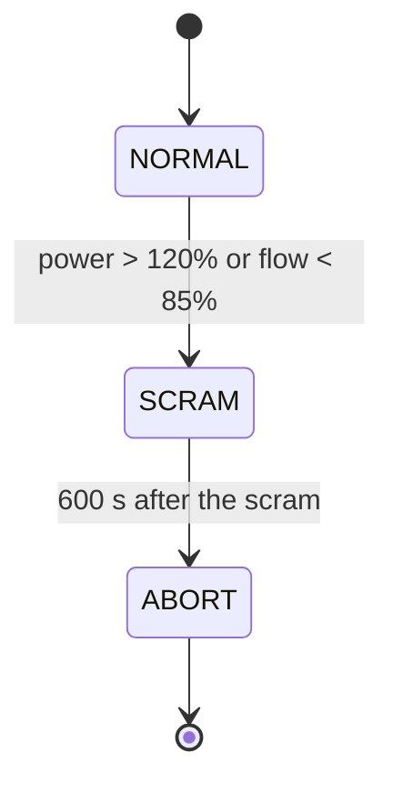

# Events and control

A reactor's protection system watches a few measured signals, such as the power, the primary
flow or a coolant temperature, and acts when one crosses a setpoint: it drops the control rods
(a scram), trips a pump, opens a valve. In a transient these actions are events. They happen
at an instant the solution itself decides, and they change the equations from that instant
on.

STREAM models a control system as a [`StateMachine`](@ref STREAM.Components.StateMachine): a
set of named states, the state it is in, and the transitions between states. Components that
act on the control system's decisions read the machine's state. The solver watches the
transitions' conditions and moves the machine when one is met.

## States and transitions

A machine is in one state at a time, `:NORMAL` by default, and remembers when it entered it.
A transition is

```julia
(from => to, condition, description)
```

and is taken when the machine is in `from` and `condition` becomes true. A condition is one of:

- an **inequality** between two expressions of the model, such as
  `pump.inlet.ṁ < 0.85 * ṁ_design`, which fires when it becomes true;
- an **equation**, such as `ch.T[5] ~ 95.0`, which fires when the two sides cross, either way;
- a **predicate** `(machine, sys, t) -> Real`, positive where it holds, for what the other two
  cannot say, such as how long the machine has been in its state:
  `(m, sys, t) -> t - m.t_state - 2.0`.



A component follows a machine by holding it: a
[`ReactivityController`](@ref STREAM.Components.ReactivityController) inserts rod reactivity
as a function of the state and the time since it was entered, a
[`Flapper`](@ref STREAM.Components.Flapper) opens while its machine is in its open state, and a
[`DecayHeatSource`](@ref STREAM.DecayHeat.DecayHeatSource) starts its decay clock at the scram.
A model can have several machines, one per piece of equipment that decides on its own, as a
valve that opens on low flow independently of the reactor protection.

## How the solver finds an event

[`machine_callbacks`](@ref STREAM.Components.machine_callbacks) turns each transition into a
continuous callback of the ODE solver. Each condition becomes a function that is positive
exactly where the condition holds: for ``a > b`` it is ``a - b``. The solver evaluates it at
every step, and when it changes sign within a step, finds the instant of the crossing by root
finding, stops there, and takes the transition. The event therefore happens at the exact time
the condition is met, not at the next saved time or the end of a step.

A few rules follow from this:

- **A condition that already holds fires at once.** When the machine enters a state, any
  transition out of it whose condition already holds is taken immediately, and so at the start
  of the run. A setpoint already passed is not missed.
- **An equation never "holds".** It has no side that is true, so it only fires on a crossing.
- **Simultaneous transitions** fire in the order they were added.
- **Predicates must have no side effects.** The solver calls them at trial points inside a
  step, not only at the points it keeps, so a predicate that changed anything would change it
  at times that never happen.
- **An abort state stops the run.** Entering a state listed in the machine's `abort_states`
  ends the integration, for a transient that has reached its end condition.

Every state entered is recorded in the machine's `log`, with the time and the description of
the transition that caused it, so after a run the machine tells you what happened and when.

## Why a machine and not an `if`

The equations of a model are compiled once. A Julia `if` on the model's variables would be
decided once, at compile time. The machine keeps the decision outside the equations: its state
is read through callable parameters, so the compiled equations stay the same and their inputs
change at the event. The setpoints themselves are compiled into the event conditions, so
changing one between runs means writing it as a parameter of the model; see
[Trip a reactor or open a valve](../howto/events.md).
