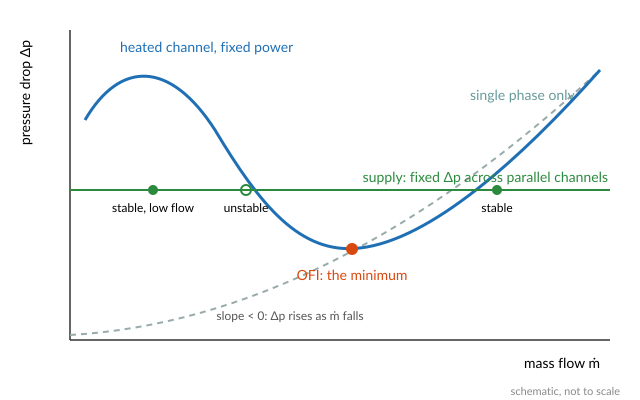

# Onset of flow instability

The onset of flow instability (OFI) is the point at which a heated channel's pressure drop
stops falling as its flow falls and starts rising instead. For a channel that shares its
pressure difference with many others, as every channel in a core does, that point is the edge
of a flow excursion: the flow can drop suddenly to a fraction of its value, and the channel
reaches critical heat flux at a power it could otherwise carry easily. In low-pressure cores
with narrow channels it is often the limit reached first at forced flow. The
[Thermal-hydraulic limits](@ref) overview explains why.

## The demand curve

Hold the power of a channel fixed and vary its flow. With no boiling, the pressure drop falls
with the flow, roughly as ``\dot m^2`` in turbulent flow. Once the flow is low enough for
boiling to start, two things change. The vapour takes up far more volume than the liquid it
came from, so the flow accelerates and its friction rises. And the lower the flow, the more of
the channel is boiling. Below some flow the second effect wins, and the pressure drop rises
as the flow falls. The curve of pressure drop against flow at fixed power, the channel's
*demand curve*, then has an S shape:



A channel operates where its demand curve meets the curve of what drives it, its *supply
curve*. That point is stable if a small drop in flow raises the driving pressure more than it
raises the demand, the criterion of Ledinegg [Ledinegg1938](@cite):

```math
\frac{\partial\,\Delta p_\text{demand}}{\partial \dot m}
> \frac{\partial\,\Delta p_\text{supply}}{\partial \dot m}.
```

A channel among many in parallel sees an almost fixed pressure difference between the plenums
above and below the core, so its supply curve is flat. Every point on the falling branch of
the demand curve is then unstable, and the minimum of the curve is where instability starts.
OFI is that minimum.

## The Whittle-Forgan correlation

Whittle and Forgan [WhittleForgan1967](@cite) measured demand curves for subcooled water in
narrow, uniformly heated channels at low pressure, the conditions of plate-fuel research
reactors. They found that the minimum occurs when the outlet bulk temperature has covered a
fixed fraction of the way from the inlet to saturation,

```math
R = \frac{T_\text{out} - T_\text{in}}{T_\text{sat} - T_\text{in}}
  = \frac{1}{1 + \eta\, D_h / L_h},
```

where ``L_h`` is the heated length and ``\eta`` an empirical constant, around 25 for their
channels. The form says that OFI comes with the outlet still subcooled, and the more so the
shorter and wider the channel: subcooled boiling at the wall makes enough void to bend the
demand curve before the bulk boils.

Fabrèga [Fabrega1971](@cite) made ``\eta`` depend on the mass flux,

```math
\eta = 3.15\,(1.08\,G)^{0.29},
```

with ``G`` evaluated at the inlet in g/(cm²·s), the units of the original (Python STREAM
quotes it: "vitesse massique à l'entrée et évaluée en CGS"). This is the form STREAM uses.
Multiplying the energy needed to bring the coolant to saturation by ``R`` gives the channel
power at OFI:

```math
Q_\text{OFI} = \frac{|\dot m|\int_{T_\text{in}}^{T_\text{sat}} c_p\,dT}{1 + \eta\,D_h/L_h}.
```

```@example ofi
using STREAM, STREAM.Thresholds, CairoMakie
CairoMakie.activate!(type="svg")

pipe = PipeGeometry_rectangular(0.6, 0.067, 0.0024, 0.067)
ṁ = range(0.02, 0.6; length=100)
G_cgs = ṁ ./ pipe.A ./ 10                 # kg/(m²·s) to g/(cm²·s)
η = 3.15 .* (1.08 .* G_cgs) .^ 0.29
R = 1 ./ (1 .+ η .* pipe.Dh ./ pipe.L)

fig = Figure(size=(700, 380))
ax1 = Axis(fig[1, 1]; xlabel=L"mass flux $G$ [kg/(m²·s)]", ylabel=L"\eta")
ax2 = Axis(fig[1, 2]; xlabel=L"mass flux $G$ [kg/(m²·s)]", ylabel=L"R")
lines!(ax1, G_cgs .* 10, η)
lines!(ax2, G_cgs .* 10, R)
fig
```

For this 0.6 m channel ``R`` stays between about 0.88 and 0.95: OFI comes when the outlet
bulk has covered 88 to 95 % of the way to saturation.

## Implications of the model

- **It is a channel-level limit.** The correlation gives one power for the whole channel,
  through the outlet temperature, and says nothing about the axial power shape. It was fitted
  to uniformly heated channels. With a peaked shape the void starts earlier in the channel,
  which the correlation does not see.
- **It uses the heated length.** STREAM takes ``L_h`` as the channel's full length
  `pipe.L`. A channel whose heated length is shorter than its hydraulic length should be
  given a geometry for the heated part.
- **The saturation temperature is at the outlet.** On a [`ChannelState`](@ref Thresholds.ChannelState),
  [`q_OFI_whittle_forgan`](@ref Thresholds.q_OFI_whittle_forgan) reads ``T_\text{sat}`` from the downstream cell, the last in
  forward flow and the first in reversed flow, since the outlet is where the coolant is
  closest to boiling.
- **It needs forced flow.** The derivation assumes a channel fed through a flat supply curve
  by forced flow. At very low or natural-circulation flow, CHF can come first, and the OFI
  power loses its meaning as the flow tends to zero.

The margin is a power ratio, ``Q_\text{OFI} / Q_\text{channel}``: how far the channel's power
could rise, at its present flow and inlet temperature, before OFI. See [Margins](@ref).

## References

```@bibliography
Pages = ["ofi.md"]
Canonical = false
```
