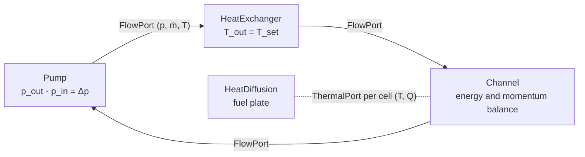

# How a model is built

A STREAM.jl model is a set of components joined by connections, in the way the plant is
built: a pump connects to a pipe, the pipe to a heat exchanger, and so on. Each component
states its own equations and nothing else. Connecting components adds the equations that
join them. [ModelingToolkit](https://docs.sciml.ai/ModelingToolkit/stable/) then
collects all of it into one system of differential-algebraic equations, simplifies it, and
generates the code a solver integrates.

This page explains that pipeline and what it means for how you write a model.

## Acausal components

A component does not say what is input and what is output. A [`Resistor`](@ref STREAM.Components.Resistor)
states

```math
p_\text{in} - p_\text{out} = R\,\dot m,
```

and that is all: it neither computes ``\dot m`` from the pressures nor the pressures from
``\dot m``. Which of them the solver treats as unknown, and in what order it solves for them,
depends on the rest of the model. This is what lets the same `Resistor` sit in a loop driven
by a fixed pump head, where it sets the flow, or by a fixed flow, where it sets the pressure
drop. It is the modelling style of Modelica, and the main difference from Python STREAM,
whose calculations each compute fixed outputs from fixed inputs and are wired into an
aggregator by hand.

## Connectors

Components meet at connectors, which carry the variables two components share. STREAM has
two.

A [`FlowPort`](@ref STREAM.Components.FlowPort) carries a pressure ``p``, a mass flow
``\dot m`` and a temperature ``T``. When ports are connected:

- the **pressure** is equal at every port of the connection;
- the **mass flows** sum to zero, each counted positive into its component, which is
  Kirchhoff's current law: mass is conserved at a junction;
- the **temperature** is a *stream* variable, carried with the flow. It is neither equalised
  nor summed. The temperature arriving at a component is the mixed temperature of whatever
  flows into the junction, and which side that is depends on the sign of the flow.

A [`ThermalPort`](@ref STREAM.Components.ThermalPort) carries a temperature ``T`` and a heat
flow ``Q``: the temperature is equal, and the heat flows sum to zero. It joins a coolant
channel's wall to a fuel plate's surface, one port per axial cell.



The stream temperature is what makes flow reversal work without special cases. A component
states two equations, one per direction: what arrives at the inlet leaves at the outlet, and
what arrives at the outlet leaves at the inlet. The solver uses whichever matches the sign of
the flow. A channel whose flow reverses during a transient simply starts taking its inlet
temperature from the other end.

## Wiring

Connections are written as equations in a list. [`inseries`](@ref STREAM.Assemblies.Connect.inseries) and [`inparallel`](@ref STREAM.Assemblies.Connect.inparallel)
generate the connections of a chain and of parallel branches, [`face`](@ref STREAM.Assemblies.Connect.face)
and [`faces`](@ref STREAM.Assemblies.Connect.faces) the per-cell thermal connections between a
channel and a plate, and any other equation can sit in the same list, such as a boundary
condition `ch.T_wall_left .~ 100.0`. [`assembly`](@ref STREAM.Assemblies.assembly) composes
the components with the list into one system.

A closed hydraulic loop determines pressure *differences* only, so one absolute pressure has
to be fixed somewhere, as in `pump.inlet.p ~ 1.0e5`. Without it the system is singular.

## Compiling

`mtkcompile` turns the composed system into something a solver can run:

1. It flattens the components and connections into one list of equations.
2. It eliminates every equation that only assigns a value, such as the many pressure
   equalities a connection makes, and moves the eliminated variables to *observed*: they are
   no longer solved for but computed from the others when you ask.
3. It reduces the index of the system. Inertia makes a mass flow differential, and connecting
   two inertias in series makes the two flows equal, which is a constraint on two
   differential variables. MTK differentiates the constraint and keeps one of them.
4. It generates the code for the residual and the sparse Jacobian.

What is left is a much smaller system than the one you wrote. A loop of a dozen components
often has only a few unknowns after compilation. Every variable of the original model can
still be read from a solution, observed or not, as `sol[sys.ch.T_out]`.

This is also why the initial guess you give matters only for the variables the compiled
system keeps. A guess for an eliminated variable has nothing to act on.

## Steady state and transient

The same compiled system serves both. [`solve_steady`](@ref) finds the state where every time
derivative is zero, and [`solve_transient`](@ref) integrates the equations in time from an
initial state, usually a steady solution. Inputs that change in time, such as a pump head
that coasts down, are functions of time stored as parameters, so the transient differs from
the steady state only in their values.
