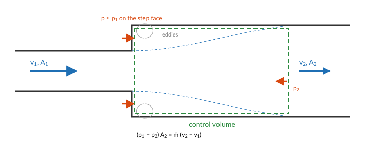

# Pressure drop

The flow through a cooling system is set by its pressures: a pump raises the pressure, and
every pipe, fitting, valve and channel lowers it, until the flow is the one at which the two
balance. This page derives the pressure drops STREAM uses from the momentum balance of the
coolant, then describes the correlations that close them.

## From Bernoulli to a loop equation

Follow a fluid particle along a streamline of coordinate ``s``. Newton's second law for it,
with only pressure and gravity acting, is Euler's equation:

```math
\rho\left(\frac{\partial v}{\partial t} + v\,\frac{\partial v}{\partial s}\right)
= -\frac{\partial p}{\partial s} - \rho\,g\,\frac{\partial z}{\partial s}.
```

For steady flow of an incompressible fluid it integrates along the streamline to Bernoulli's
law: the *total pressure* plus the hydrostatic head is constant,

```math
p + \tfrac12\rho v^2 + \rho g z = \text{const}.
```

A real pipe departs from this in two ways. Viscosity turns part of the mechanical energy into
heat, which shows up as a loss of total pressure, ``\Delta p_\text{loss}``, always against
the flow. And in a transient the flow accelerates, which takes the integral of the
``\partial v/\partial t`` term. Integrating Euler's equation from section 1 to section 2 of a
pipe, with the velocity uniform over each cross-section, ``v = \dot m/(\rho A)``, gives the
mechanical energy balance:

```math
\underbrace{\left(p + \tfrac12\rho v^2\right)_1 - \left(p + \tfrac12\rho v^2\right)_2}_{\text{total pressure drop}}
= \underbrace{\rho g\,(z_2 - z_1)}_{\text{gravity}}
+ \underbrace{\Delta p_\text{loss}}_{\text{friction and fittings}}
+ \underbrace{\int_1^2 \frac{ds}{A}\;\frac{d\dot m}{dt}}_{\text{inertia}}.
```

The inertia term follows from ``\rho\,\partial v/\partial t = (1/A)\,d\dot m/dt`` for a liquid
with one flow along the pipe. For a pipe of uniform area it is ``(L/A)\,d\dot m/dt``.

Around a closed loop the total pressure returns to its starting value, so the pump head
equals the sum of the right-hand sides over the loop. That is the equation a STREAM loop
solves, split over its components: each states its own share. A
[`FlowPort`](@ref STREAM.Components.FlowPort) carries the total pressure ``p + \tfrac12\rho v^2``,
so a junction between pipes of different area equalises total pressure, and the static
pressure on either side follows from Bernoulli. A channel recovers its static pressure the
same way, to evaluate saturation (see [The coolant channel](@ref)).

The rest of this page takes the terms one at a time.

## Friction

**The force balance.** In fully developed flow the velocity profile does not change along
the pipe, so the fluid neither gains nor loses momentum. The pressure force on a slug of
length ``L`` balances the shear stress ``\tau_w`` the wall exerts on it:

```math
(p_1 - p_2)\,A = \tau_w\,P_w\,L
\qquad\Longrightarrow\qquad
\Delta p_f = \frac{4\,\tau_w\,L}{D_h}, \qquad D_h = \frac{4A}{P_w},
```

with ``P_w`` the wetted perimeter. This is where the hydraulic diameter comes from: it is the
length that makes a duct of any shape look like a circular pipe to the force balance, and
for a circle it is the diameter. Writing the wall stress in units of the dynamic pressure,
``\tau_w = (f/4)\,\tfrac12\rho v^2``, defines the Darcy friction factor ``f`` and gives the
Darcy-Weisbach equation:

```math
\Delta p_f = f\,\frac{L}{D_h}\,\frac{\rho v^2}{2} = f\,\frac{L}{D_h}\,\frac{\dot m|\dot m|}{2\rho A^2},
```

with ``\dot m|\dot m|`` in place of ``\dot m^2`` so that friction always opposes the flow,
including reversed flow.

**Laminar flow** can be solved exactly. In a circular pipe the axial momentum equation
reduces to a balance of the pressure gradient and viscous stress, whose solution is the
parabolic Hagen-Poiseuille profile ``u(r) = 2v\,(1 - r^2/R^2)``. Its wall stress is
``\tau_w = \mu\,|du/dr|_{r=R} = 8\mu v/D``, so

```math
f = \frac{8\,\tau_w}{\rho v^2} = \frac{64\,\mu}{\rho v D} = \frac{64}{\text{Re}},
```

which is [`Friction.Laminar`](@ref). Other cross-sections give other constants. For a
rectangular duct the constant depends on the aspect ratio, ``f = 64/(\text{Re}\,K_R)``, with
``K_R`` from a fit given in [KAERI2014](@cite) ([`Friction.RectangularLaminar`](@ref)): 0.667
between parallel plates, 1.12 for a square. The laminar friction of a narrow plate-fuel
channel is therefore about 1.5 times the circular value.

**Turbulent flow** has no exact solution. Near the wall the velocity follows a universal
logarithmic profile, and integrating it over the cross-section gives an implicit relation
between ``f`` and Re, the Colebrook-White equation [Colebrook1939](@cite), which
[`Friction.Turbulent`](@ref) evaluates in an explicit form, with wall roughness.
Blasius found the simpler fit ``f = 0.3164\,\text{Re}^{-1/4}`` [Blasius1913](@cite) for smooth
pipes at ``4000 < \text{Re} < 10^5`` ([`Friction.Blasius`](@ref), the default). It corresponds
to the empirical one-seventh power velocity profile, and it is why the turbulent pressure drop
goes as ``\dot m^{1.75}`` rather than ``\dot m^2``.

**Across the transition**, [`Friction.RegimeDependent`](@ref) blends a laminar and a turbulent
branch linearly between two Reynolds numbers, 2000 and 5000 by default, and returns zero at
zero flow. Both matter for a transient that passes through low flow: the blend keeps ``f``
continuous, and the guard avoids the infinite ``64/\text{Re}`` at ``\text{Re} = 0``, where
the pressure drop itself, ``\propto f\,\text{Re}^2``, goes smoothly to zero.

```@example dp
using STREAM, CairoMakie

geom = PipeGeometry_rectangular(0.6, 0.067, 0.0024, 0.067)
Re = 10 .^ range(2, 5; length=300)
k_R = Friction.rectangular_correction(geom.depth / geom.width)
rd = Friction.RegimeDependent(; k_R)

fig = Figure(size=(700, 440))
ax = Axis(fig[1, 1]; xscale=log10, yscale=log10, xlabel="Reynolds number",
          ylabel=L"Darcy friction factor $f$")
lines!(ax, Re, Friction.laminar.(Re); label="laminar, circular")
lines!(ax, Re, Friction.laminar.(Re .* k_R); label="laminar, plate channel")
lines!(ax, Re, Friction.blasius.(Re); label="Blasius")
lines!(ax, Re, Friction.turbulent.(Re); label="Colebrook-White, smooth")
# The model takes a mass flow, so turn each Reynolds number into one at 40 °C.
ṁ = Re .* geom.A .* μ(H2O, 40.0) ./ geom.Dh
lines!(ax, Re, [rd(40.0, 40.0, m, H2O, geom) for m in ṁ];
       label="regime dependent, plate channel", linewidth=3, color=(:black, 0.35))
axislegend(ax; position=:rt)
fig
```

**Heated walls.** The wall stress is set by the viscosity at the wall. Next to a heated wall
the coolant is hotter and less viscous than the bulk, so the friction is lower than a
correlation evaluated at the bulk temperature says. `RegimeDependent` takes an optional
correction, [`Friction.viscosity_correction`](@ref), weighted by the share of the perimeter
that is heated:

```math
K_H = 1 + \frac{P_\text{heated}}{P_\text{wet}}\left[\left(\frac{\mu_w}{\mu_b}\right)^{0.58} - 1\right],
```

which multiplies ``f``. It is off by default, as in Python STREAM.

## Local losses

A sudden change of area, a bend, a grid or an orifice loses total pressure in a short
length, in the eddies the flow sheds as it separates from the wall. The loss is again
written in units of the dynamic pressure, with a loss coefficient ``K`` for the fitting:

```math
\Delta p_K = K\,\frac{\dot m|\dot m|}{2\rho A^2}.
```

For a **sudden expansion** from area ``A_1`` to ``A_2``, ``K`` follows from first principles.



Take a control volume from just past the step to where the jet has spread across the wider
pipe. The pressure on the step face is still about ``p_1``, since the jet leaving the narrow
pipe has not yet felt the expansion. The momentum balance on the control volume is then

```math
(p_1 - p_2)\,A_2 = \dot m\,(v_2 - v_1) = \rho A_2 v_2\,(v_2 - v_1),
```

and the loss of total pressure is

```math
\Delta p_K = \left(p_1 + \tfrac12\rho v_1^2\right) - \left(p_2 + \tfrac12\rho v_2^2\right)
= \tfrac12\rho\,(v_1 - v_2)^2
= \left(1 - \frac{A_1}{A_2}\right)^2 \tfrac12\rho v_1^2,
```

the Borda-Carnot loss, ``K = (1 - A_1/A_2)^2``. A **sudden contraction** loses less: the flow
contracts smoothly into the narrow pipe, and the loss is in the expansion from the *vena
contracta* that forms just past the entrance:
``K \approx 0.5\,(1 - A_\text{narrow}/A_\text{wide})^{3/4}``, on the dynamic pressure in the
narrow pipe.

[`LocalPressureDrop`](@ref STREAM.Components.LocalPressureDrop) uses these closed forms at
high Reynolds number, and Idelchik's tables [Idelchik1996](@cite) at low Reynolds number,
where viscosity raises ``K``. The direction of the flow decides which applies: a sudden
expansion in forward flow is a sudden contraction in reversed flow.

For a fitting with no correlation, a measured or design operating point is enough.
[`ResistorFromKnownPoint`](@ref STREAM.Components.ResistorFromKnownPoint) builds a quadratic
loss through a known ``(\Delta p, \dot m)`` at a known temperature, which is how a loop is
calibrated against plant data. [`VolumetricFlowResistor`](@ref STREAM.Components.VolumetricFlowResistor)
takes the loss coefficient in terms of volumetric flow, the way pump and valve data are often
given.

## Gravity

With the fluid at rest, Euler's equation reduces to the hydrostatic balance
``dp/dz = -\rho g``: a column of height ``H`` weighs ``\rho g H`` per unit area.
[`Gravity`](@ref STREAM.Components.Gravity) adds it to a loop, with ``\rho`` at the temperature
of the coolant passing through, and a channel adds it cell by cell. Around a closed loop the
heights cancel, but the densities do not. A loop whose rising leg of height ``H`` is hotter
than its falling leg has a net buoyancy head

```math
\Delta p_\text{buoyancy} = \oint \rho\,g\,dz = g\,H\,(\rho_\text{cold} - \rho_\text{hot}),
```

which drives natural circulation. This is why the sign of ``g`` on every channel and gravity
element matters, and [`check_gravity_mismatch`](@ref STREAM.Assemblies.check_gravity_mismatch)
checks that the channels of a loop agree about which way is up.

## Inertia

The inertia term of the loop equation, ``(L/A)\,d\dot m/dt``, is the pressure it takes to
accelerate the coolant in a pipe of length ``L`` and area ``A``.
[`Inertia`](@ref STREAM.Components.Inertia) adds it to a loop, and a channel carries its own.
Its main use is a flywheel or a long pipe that keeps the flow going after a pump trip. With
the pump off and a quadratic loss ``k\,\dot m^2`` in the loop, the loop equation is
``(L/A)\,d\dot m/dt = -k\,\dot m^2``, and the flow coasts down as

```math
\dot m(t) = \frac{\dot m_0}{1 + \dot m_0\,(k A/L)\,t},
```

so a larger ``L/A`` keeps the flow longer. The [Pump coastdown](../tutorials/03_pump_coastdown.md)
tutorial checks STREAM against this solution.

## Implications of the choices

- **At low flow the quadratic losses vanish.** Turbulent friction and local losses go as
  ``\dot m^{1.75}`` to ``\dot m^2``, so at the low flows of natural circulation they are small,
  and the laminar friction, linear in ``\dot m``, sets the flow. A loop model that is accurate
  at full flow can be poor at natural circulation if its low-flow behaviour was never
  checked.
- **The friction factor is fitted to fully developed flow.** The entrance region of a channel,
  where the profile is still developing, has a higher wall stress. Entrance effects, spacers
  and plate-end fittings belong in local loss terms.
- **Pressure drops are evaluated at single-phase density.** Boiling would raise the friction
  and add an acceleration loss, as the vapour accelerates the flow. This is the effect behind
  the [Onset of flow instability](@ref), and STREAM does not model it.

## References

```@bibliography
Pages = ["pressure_drop.md"]
Canonical = false
```
