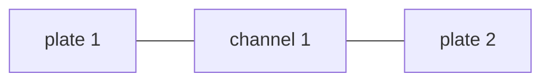
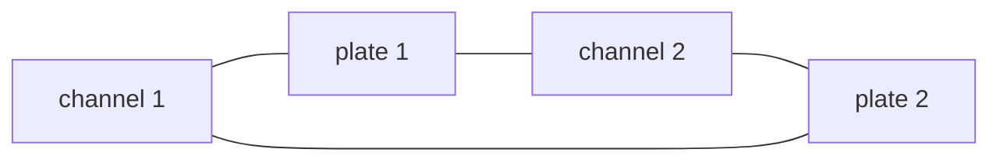

# Build a fuel assembly

A fuel assembly is a stack of plates with coolant channels between them. STREAM wires plates
([`HeatDiffusion`](@ref STREAM.Components.HeatDiffusion)) and channels
([`ChannelAndContacts`](@ref STREAM.Components.ChannelAndContacts)) together face by face, cell
by cell. Each arrangement below returns an uncompiled system with the thermal connections
made, and leaves the hydraulics to you.

| Function | Arrangement |
|:---|:---|
| [`symmetric_plate`](@ref STREAM.Assemblies.symmetric_plate) | one channel and one plate standing for an infinite repeating stack |
| [`plate`](@ref STREAM.Assemblies.plate) | one plate between two channels |
| [`one_sided`](@ref STREAM.Assemblies.one_sided) | one channel cooling one face of a plate, the other face adiabatic |
| [`single_channel`](@ref STREAM.Assemblies.single_channel) | one channel with a plate on one side |
| [`fuel_assembly`](@ref STREAM.Assemblies.fuel_assembly) | any alternating chain of channels and plates |

In all of them, each plate needs as many axial cells, `nz`, as the channels it touches have,
`n`, and its depth `y` should be the heated width of the channel faces.

## The four shapes of a chain

`fuel_assembly(channels, plates)` alternates channels and plates in the order given, joining
each one's right face to the next one's left face. Faces at the ends of an open chain are left
unconnected, which makes them adiabatic. Which shape you get follows from the counts:

**Channel-bookended**, one more channel than plates. The outer channels each cool one plate,
and see an adiabatic wall on their outer side, like the side plates of a real assembly.


**Plate-bookended**, one more plate than channels. The outer plates are cooled on one face
only.



**Mixed**, equal counts, with `bookend=:mixed` and `start=:channel` or `start=:plate` to say
which end is which.


**Closed**, equal counts with `closed=true`. The last element wraps around to the first, as in
an annular assembly of curved plates.



## A three-channel assembly

Two plates between three channels, all three fed from one pump:

```@example fa
using STREAM
using STREAM.Components: Pump, HeatExchanger, ChannelAndContacts, HeatDiffusion
using STREAM.Assemblies: inseries, inparallel, fuel_assembly
using ModelingToolkit: @named, mtkcompile
using OrdinaryDiffEq: Rodas5P
using SteadyStateDiffEq: DynamicSS

n, P_plate = 8, 1.0e4
geometry = PipeGeometry_rectangular(0.6, 0.067, 0.0024, 0.063)
fuel_plate(name) = HeatDiffusion(; name, nz=n, nx=2, Lz=0.6, Lx=0.00127, y=0.063,
                            rho_s=2700.0, cp_s=900.0, k_s=180.0, power=P_plate)
coolant_channel(name) = ChannelAndContacts(; name, n, geometry)

asm = fuel_assembly([coolant_channel(:c1), coolant_channel(:c2), coolant_channel(:c3)],
                    [fuel_plate(:p1), fuel_plate(:p2)];
                    name=:asm)
@named pump = Pump(; ṁ0=1.2)
@named hx = HeatExchanger(40.0)
connections = [
    inseries(pump, hx),
    inparallel(hx, [asm.c1, asm.c2, asm.c3], pump),
    pump.outlet.p ~ 1.7e5,
]
@named loop = assembly(connections, pump, hx, asm)
sys = mtkcompile(loop)
guess = [sys.asm.c2.inlet.ṁ => 0.4, sys.asm.c3.inlet.ṁ => 0.4]
sol = solve_steady(sys, guess; solver=DynamicSS(Rodas5P()), abstol=1e-10, reltol=1e-10)
[round(sol[getproperty(sys.asm, c).T_out]; digits=2) for c in (:c1, :c2, :c3)]
```

Parallel channels sharing a flow are the case [Get a steady solve to converge](steady_solve.md)
recommends integrating to steady state for, with a guess for each flow the compiled system
keeps (here those of `c2` and `c3`).

The middle channel is heated by both plates and runs hotter than the outer two, each heated
by one. Each plate sends more of its heat to its outer, cooler channel than to the middle one:

```@example fa
[(left=round(sum(sol[getproperty(sys.asm, c).q_wall_left])), right=round(sum(sol[getproperty(sys.asm, c).q_wall_right])))
 for c in (:c1, :c2, :c3)]
```

All of the plates' power reaches the coolant:

```@example fa
Q = sum(sol[getproperty(sys.asm, c).Q_wall_total] for c in (:c1, :c2, :c3))
@assert isapprox(Q, 2P_plate; rtol=1e-6)
Q
```

The components keep the names they were built with, so the middle channel is `sys.asm.c2`
and the first plate `sys.asm.p1`.

## When the plates differ

`plate` joins one plate to two different channels, for a plate whose neighbours differ, and
`fuel_assembly` accepts different plates and channels in one chain: give each plate its own
power and shape, and each channel its own geometry, and the wiring is the same.
